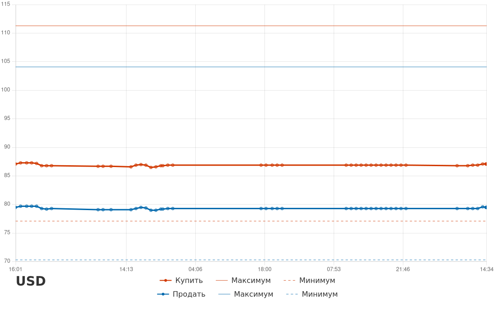

# money-bot

Телеграм-бот, который следит за курсами валют Сбербанка: периодически опрашивает
официальный курс, ведёт историю по каждой валюте, строит графики и оповещает
пользователей о срабатывании заданных порогов.

## Возможности

- Периодический опрос курса Сбербанка (`sber.js`) с интервалом
  `UPDATE_CURRENCY_INTERVAL_SEC`; при старте бот проверяет время последнего
  сохранённого в истории запроса и не опрашивает сайт слишком часто (защита от
  частых перезапусков при отладке).
- Хранение истории курсов по каждой валюте (`botstore.js`), с ограничением
  длины истории (`HISTORY_MAX_LEN`) и отслеживанием абсолютных
  максимума/минимума курсов покупки и продажи.
- Построение графика курса «Купить»/«Продать» с отметками максимума, минимума
  и дельты (`chart.js`) — используется командой `/getrates`.

  
- Уведомления в Telegram (`tgservice.js`, `bot.js`):
  - `/getrates` — график и текущие значения по каждой валюте;
  - `/setalarm [ISO] [value]` — предупреждение о пересечении курсом порога;
  - `/setdeltaalarm [ISO] [value]` — предупреждение о резком изменении курса;
  - `/report [enable|disable]` — включить/выключить уведомления об
    обновлении максимума/минимума;
  - `/getalarms`, `/getusers` — служебные команды (последняя только для
    администратора).
  - Удалённое обновление: администратор может прислать боту ZIP-архив
    (`updater.js`) — файлы из архива распаковываются поверх текущего кода
    (кроме `.env`, `.git`, `node_modules`, `history`, `config`), при
    необходимости выполняется `npm install`, после чего бот перезапускается.
  - `/getlogs` — прислать файл лога бота (`logger.js`, только для
    администратора). Полезно при работе на арендованном VPS без прямого
    доступа к консоли: лог пишется в `bot.log` в корне проекта с ротацией
    при достижении 5МБ (см. `LOG_FILE_NAME` в `.env`).
- Альтернативный запуск с уведомлениями по email вместо Telegram
  (`botmailer.js`, `emailService.js`) — те же алармы и события, плюс
  ежедневный отчёт с графиками в 9:00.

## Запуск

1. Скопировать `.env.example` в `.env` и заполнить значения (токен бота,
   список валют, путь к хранилищу истории, интервал опроса и т.д.).
2. Установить зависимости: `npm install`.
3. Запустить телеграм-бота: `node bot.js`.
   Либо почтовую версию: `node botmailer.js`.

## Структура проекта

- `bot.js` — основная точка входа, обработчики команд Telegram.
- `botmailer.js` — альтернативная точка входа с оповещениями по email.
- `botstore.js` — хранилище пользователей, алармов и истории курсов.
- `sber.js` — запрос курсов с сайта Сбербанка.
- `chart.js` — построение графиков курса для отправки в Telegram/email.
- `tgservice.js` — обёртка над Telegram Bot API.
- `emailService.js` — обёртка над отправкой почты (SMTP).
- `utils/utils.js` — вспомогательные функции.
- `history/` — сохранённая история курсов по валютам (JSON, не в репозитории).
